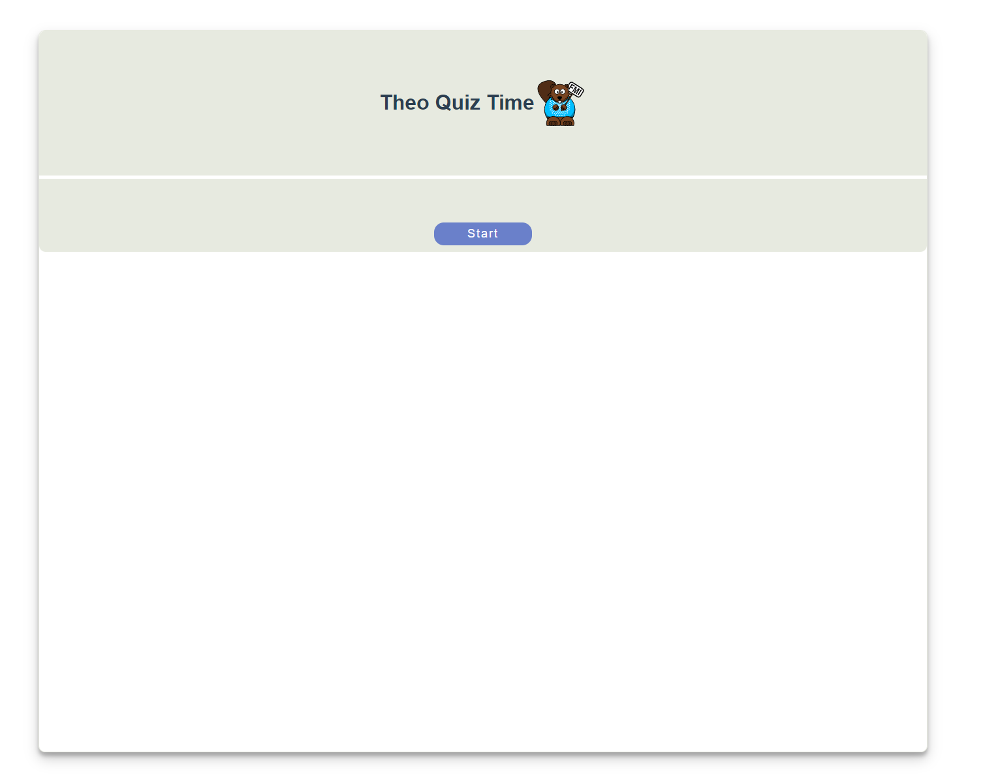

# Theo-app

## Description
This project implements a quiz app that can help prepare for the Theoretical Computer Science 2 exam. There are multiple choice quiz questions where only one answer is correct.

The questions are presented in a relational database in latex notation.
